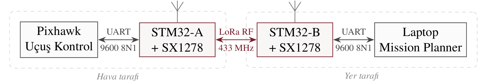
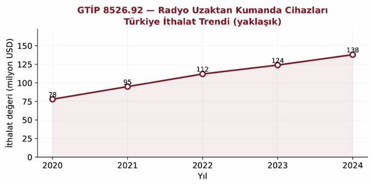
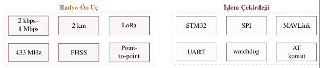
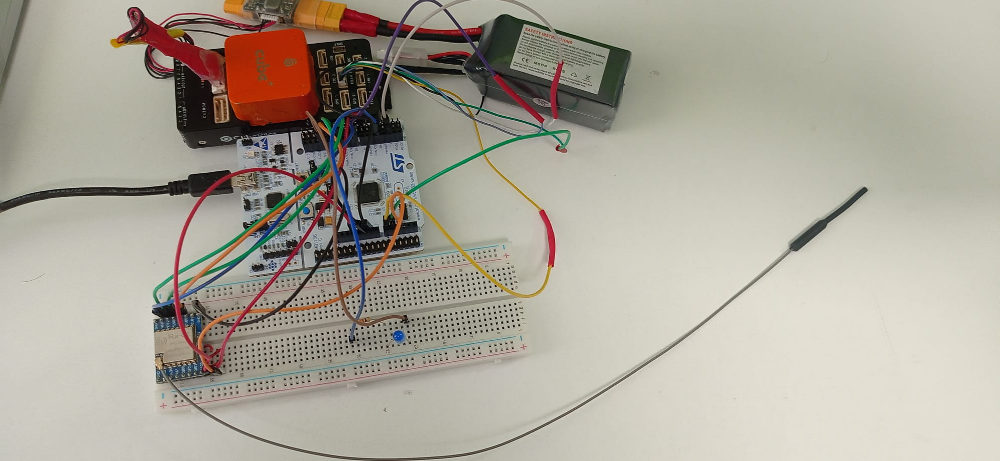
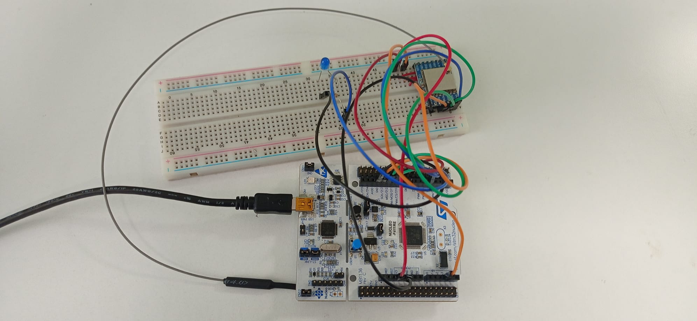
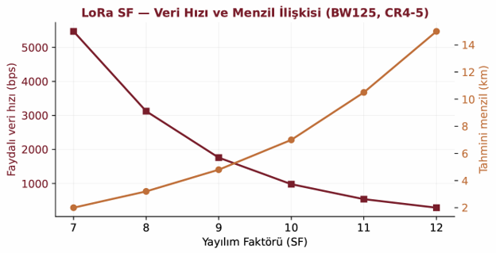
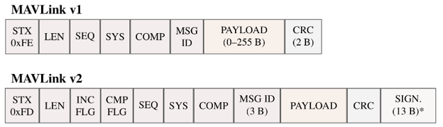
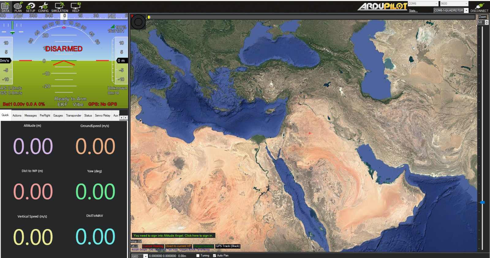
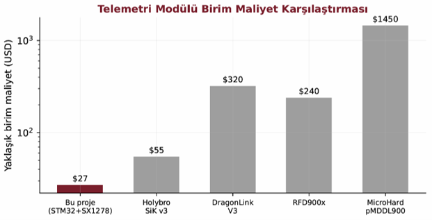

# UAV-Compatible RF Telemetry Module

A low-cost, open-architecture, MAVLink-compatible telemetry bridge for unmanned aerial vehicles (UAVs), built around an STM32 microcontroller and a LoRa radio. The project pairs two identical units — one attached to the flight controller, one to the ground station — to carry a bidirectional telemetry link over 433 MHz.

This was developed as an undergraduate graduation project in Electrical & Electronics Engineering at Istanbul Sabahattin Zaim University.

---

## Motivation

UAV telemetry links are one of the most critical components of any drone after the flight controller itself. In Turkey, however, ready-made telemetry modules are almost entirely imported, closed-source, and relatively expensive. For student competition teams (Teknofest and similar) and hobbyists, this creates a barrier on both cost and flexibility — there is no easy way to customize the hardware or firmware.

Market research carried out for the project confirmed the gap: import volumes for the relevant customs categories have been climbing steadily, yet no domestic brand mass-produces a MAVLink/LoRa-compatible telemetry module. Academic efforts mostly stay at the prototype stage.

The goal was therefore a domestic, open, reconfigurable alternative that students can actually learn from and build on.

---

## What it does

The system is a symmetric bridge: two identical units run the same firmware, with the air/ground role chosen at build time. Each unit takes a MAVLink stream in over a serial link and carries it across the LoRa physical layer to the other side.

Key characteristics:

- **Radio:** LoRa on the 433 MHz ISM band, point-to-point
- **Processing core:** STM32 (ARM Cortex-M) handling data processing, MAVLink packet management, and the multiple-access timing
- **Protocol:** open-source MAVLink (the de-facto standard for ArduPilot and PX4 flight stacks)
- **Collision-free link:** a time-division scheme keeps the two units from transmitting over each other
- **Target cost:** roughly an order of magnitude below comparable imported modules

---

## Hardware

| Component | Part |
|---|---|
| Microcontroller | STM32F411RE (Nucleo) |
| RF module | Ai-Thinker Ra-02 (SX1278), 433 MHz LoRa |
| Antenna | 433 MHz λ/4 |
| Flight controller | Pixhawk (PX4 / ArduPilot) |
| Ground station | Mission Planner (Windows) |

The two units as assembled on breadboards for bring-up and testing:

*Air side: Pixhawk + STM32F411RE + SX1278*

*Ground side: STM32F411RE + SX1278*

---

## Radio configuration

LoRa trades data rate against range through its spreading factor (SF), bandwidth, and coding rate. The project settled on **SF7 / BW125 / CR4-5**, which yields roughly **5.5 kbps** of useful throughput — comfortably enough to carry a trimmed-down MAVLink stream once the flight controller's telemetry is reduced to the essentials.

Higher spreading factors extend range at the cost of throughput, leaving headroom to push for longer links in future field tests.

---

## MAVLink framing

The bridge recognizes MAVLink packet boundaries at the byte level and re-frames them across the radio link. Both v1 (start byte `0xFE`) and v2 (start byte `0xFD`) frame formats are handled.

---

## Results

A working prototype of the telemetry bridge was demonstrated end to end (Pixhawk → STM32 → LoRa → STM32 → Mission Planner).

**What worked:**

- Point-to-point LoRa communication verified on both units
- SPI-based STM32 ↔ SX1278 communication confirmed
- The byte-level MAVLink framer correctly separated packet boundaries — across a 60-second measurement, every observed packet was recognized as valid MAVLink v2 with zero oversize errors
- A stable heartbeat connection established in Mission Planner, with live telemetry (position, altitude, battery voltage, VFR HUD) updating reliably at 1 Hz in both directions
- Indoor range testing showed under 3% packet loss out to 50 m

*Live telemetry through the bridge in Mission Planner*

**Indoor range / signal measurements:**

| Distance (m) | RSSI (dBm) | SNR (dB) | Packet loss (%) |
|---|---|---|---|
| 1 | −32 | 10.0 | 0.0 |
| 10 | −56 | 9.0 | 0.3 |
| 25 | −74 | 7.5 | 0.9 |
| 50 | −91 | 5.0 | 2.4 |
| 80 | −104 | 1.5 | 8.7 |

These were taken indoors through walls in an interference-heavy environment, so they understate the open-field range the link can achieve.

**Cost comparison** against the imported modules it aims to replace, on a logarithmic scale:

---

---

## Keywords

UAV · LoRa · MAVLink · STM32 · SX1278 · Telemetry
